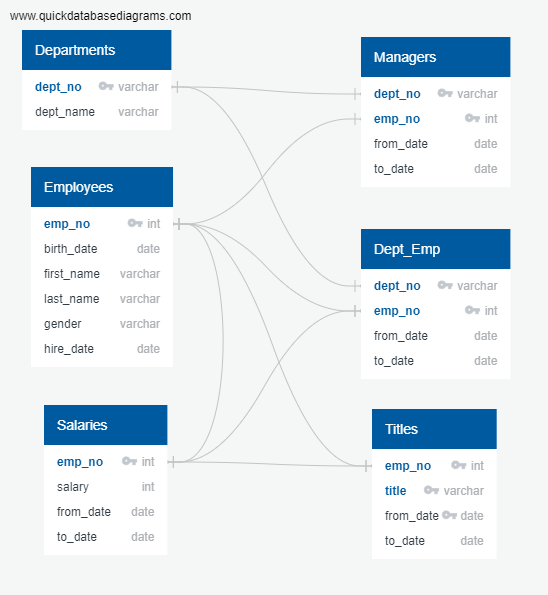
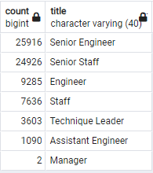
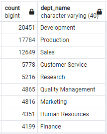

# hewlett-packard-analysis

## Overview
The purpose of this analysis is to investigate the number of employees expected to be retiring based on a determined estimate of average retirement age. 
In addition, further investigation was done to determine the feasibility of founding a mentoship program in preparation for the expected departures, based on personnel capacity at the current time. 

- Note: Eligibility for retirement designation in this report is predicated on the employee meeting
 certain age criteria. Employees born between January 1st, 1952 and December 31st, 1955 will be included in this
investigation. 
- Note: Eligibility for mentorship program in this report is predicated on the employee meeting certain criteria. 
The potential mentor must be meet prior criteria for retirement designation. In addition, the potential mentor must still be currently employed by the company.  
### Database Utilized 

## Results

1. Currently, there are 72,458 retirement-eligible employees. 
2. The largest group of expected retirees are currently employed as Senior Engineers, at 25,916 employees. It can be assumed that this group will require the greatest number of promotions/incoming hires to maintain normal operations.   

3. The smallest group of expected retirees are currently employed as Managers, at 2 employees. New hiring for these positions will not need to be prioritized as much as the Senior Engineer position. 
4. There are currently 1,449 employees eligible to act as mentors to newer employees. 

## Summary

While an exact number of necessary replacements cannot be determined based off of the information analyzed, it should be noted that the expected employee loss is staggering. 
The company is expected to lose both numbers and experience, as the retiring employees are likely the ones with the most on-the-job experience.    
In order to ensure a smooth transition, all focus should be put into guaranteeing that the employees who will carry the torch after the retiring employees leave are fully trained and capable of replacing their elders. 
Recommendations for hiring quotas would be to - ideally - have a 1:1 replacement plan in place for both the retiring employees AND the employees that will be internally promoted. 
There will be experience gaps all throughout the employment ladder if hiring processes do not begin soon. 
Ideally, new employees would be brought on as soon as possible in order to train everyone as much as possible prior to the exit of the retiring employees.   
As of right now, it would appear that the company is short on mentors if the planned approach is to operate on a 1:1 mentor:mentee relationship.
A possible solution would be to increase the number of mentees each mentor takes on. This does run the risk of lowering the quality of the mentorship program, but it would guarantee that more people have access to the additional training that is expected to be necessary. 
#### Recommendations 
- Hire often and soon for all titles
- Begin the process of shuttling potential promotees into mentorship programs to help them gain necessary experience prior to promotion
- Ideally, aim to overstaff the company for the time being. This may cause a short-term decrease in net company profits, but it will ensure that productivity will not suffer when the retirement wave begins. 
- Are there enough qualified, retirement-ready employees in the departments to mentor the next generation of Pewlett-Hackard employees? 

#### Additional Query One: Which department will be most heavily impacted by retirement wave? 
Based on the obtained list of expected retirees, the department that will be the most heavily impacted by the 'silver tsunami' as older employees retire will be Development at 20,451 expected retirees.  
 
#### Additional Query Two